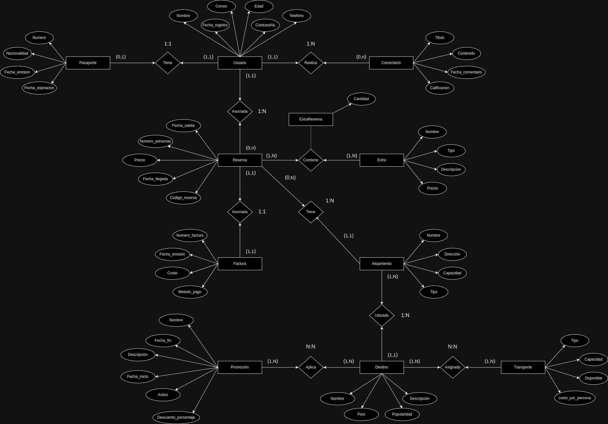

A continuación se especifica en que consiste cada modelo, cada atributo y cada parámetro usado. Y el esquema de modelo entidad-relación.

1. Usuario
El modelo Usuario representa a los usuarios que se registran en la plataforma. Sus atributos son:

- nombre: Almacena el nombre completo del usuario. Es de tipo CharField con un máximo de 200 caracteres (max_length=200, verbose_name="Nombre Completo").
- correo: Es un campo de tipo EmailField donde se guarda el correo electrónico del usuario.
- telefono: Guarda el número de teléfono del usuario. Es un CharField con un máximo de 20 caracteres (max_length=20).
- edad: Este campo almacena la edad del usuario como un entero (IntegerField).
- contraseña: Es la contraseña que el usuario utiliza para acceder a la plataforma. También es un CharField con un máximo de 200 caracteres (max_length=200).
- fecha_registro: Fecha en la que el usuario se registró. Es de tipo DateField y puede ser nulo o estar en blanco (null=True, blank=True).


2. Destino
El modelo Destino guarda información sobre los destinos turísticos disponibles. Los atributos que tiene son:

- nombre: Es el nombre del destino turístico. Este campo es de tipo CharField con un máximo de 200 caracteres (max_length=200).
- pais: Guarda el nombre del país donde se encuentra el destino. Es de tipo CharField con un máximo de 50 caracteres (max_length=50).
- descripcion: Es una descripción opcional del destino. Se almacena como TextField y puede ser nulo o estar en blanco (null=True, blank=True).
- popularidad: Es un campo de tipo FloatField donde se almacena la calificación de popularidad del destino, que debe estar entre 0 y 5. Usa validadores MinValueValidator(0) y MaxValueValidator(5)


3. Reserva
El modelo Reserva guarda información sobre las reservas hechas por los usuarios. Los atributos son:

- codigo_reserva: Es un código único para identificar cada reserva, almacenado en un CharField con un máximo de 20 caracteres (max_length=20).
- fecha_salida: Fecha y hora de salida de la reserva, se guarda como DateTimeField.
- fecha_llegada: Fecha y hora de llegada de la reserva, también un DateTimeField.
- numero_personas: Guarda el número de personas incluidas en la reserva como un entero positivo (PositiveIntegerField).
- precio: Precio total de la reserva, almacenado en un campo de tipo DecimalField con un máximo de 10 dígitos, de los cuales 2 son decimales (max_digits=10, decimal_places=2).
- usuario: Relación one-to-one con el modelo Usuario, cada reserva está asociada a un único usuario (OneToOneField(Usuario, on_delete=models.CASCADE)).


4. Comentario
El modelo Comentario almacena los comentarios que los usuarios dejan sobre destinos o reservas. Los atributos son:

- titulo: Título del comentario, almacenado en un CharField con un máximo de 100 caracteres (max_length=100).
- contenido: El contenido del comentario, de tipo TextField.
- fecha_comentario: Fecha en la que se hizo el comentario, se almacena automáticamente con la fecha y hora actual (auto_now_add=True).
- calificacion: Calificación del comentario, es un FloatField que acepta valores entre 0 y 5, con los validadores correspondientes (MinValueValidator(0), MaxValueValidator(5)).
- usuario: Relación many-to-one con el modelo Usuario, ya que un usuario puede dejar varios comentarios, pero cada comentario pertenece a un único usuario (ForeignKey(Usuario, on_delete=models.CASCADE)).


5. Alojamiento
Este modelo almacena información sobre los alojamientos disponibles en cada destino. Sus atributos son:

- nombre: Nombre del alojamiento, se guarda en un CharField de hasta 200 caracteres (max_length=200).
- direccion: Dirección del alojamiento, es un CharField de hasta 200 caracteres (max_length=200).
- capacidad: Capacidad máxima de personas que el alojamiento puede recibir, es un entero (IntegerField).
- tipo: El tipo de alojamiento (hotel, apartamento, etc.), es un CharField de hasta 50 caracteres (max_length=50).
- destino: Relación many-to-one con el modelo Destino. Varios alojamientos pueden estar en un mismo destino, pero un alojamiento pertenece a un único destino (ForeignKey(Destino, on_delete=models.CASCADE)).
- reserva: Relación many-to-one con el modelo Reserva, donde un alojamiento puede estar en varias reservas (ForeignKey(Reserva, on_delete=models.CASCADE)).


6. Extra
El modelo Extra guarda los servicios o extras disponibles para las reservas. Sus atributos son:

- nombre: Nombre del extra, guardado en un CharField de hasta 100 caracteres (max_length=100).
- tipo: Tipo de extra (actividad, guía turístico, transporte, etc.). Usa un campo de tipo CharField con opciones predefinidas (choices=TIPOS_EXTRAS, max_length=50).
- descripcion: Descripción del extra, de tipo TextField.
- precio: Precio del extra, almacenado en un DecimalField con un máximo de 8 dígitos y 2 decimales (max_digits=8, decimal_places=2).
- reserva: Relación many-to-many con el modelo Reserva usando una tabla intermedia llamada ExtraReserva (ManyToManyField(Reserva, through="ExtraReserva")).


7. Pasaporte
El modelo Pasaporte guarda la información del pasaporte de los usuarios. Sus atributos son:

- numero: Número único del pasaporte, se guarda en un CharField de hasta 50 caracteres (max_length=50, unique=True).
- fecha_emision: Fecha de emisión del pasaporte, almacenada en un DateField.
- fecha_expiracion: Fecha de expiración del pasaporte, también es un DateField.
- nacionalidad: Nacionalidad del titular del pasaporte, es un CharField con un máximo de 50 caracteres (max_length=50).


8. Transporte
Este modelo guarda información sobre los transportes disponibles para los destinos. Los atributos son:

- tipo: Tipo de transporte (bus, avión, etc.), es un CharField de hasta 50 caracteres (max_length=50).
- capacidad: Capacidad máxima de personas que pueden viajar en el transporte, es un PositiveIntegerField.
- disponible: Indica si el transporte está disponible (BooleanField(default=True)).
- costo_por_persona: Precio por persona del transporte, se almacena en un DecimalField con un máximo de 8 dígitos y 2 decimales (max_digits=8, decimal_places=2).
- destino: Relación many-to-many con el modelo Destino (ManyToManyField(Destino)).


9. Promocion
El modelo Promocion guarda las promociones aplicables a destinos o alojamientos. Los atributos son:

- nombre: Nombre de la promoción, guardado en un CharField de hasta 100 caracteres (max_length=100).
- descripcion: Descripción de la promoción, almacenada en un TextField.
- descuento_porcentaje: Porcentaje de descuento aplicado, es un FloatField con validadores que limitan el valor entre 0 y 100 (MinValueValidator(0), MaxValueValidator(100)).
- fecha_inicio: Fecha de inicio de la promoción, se guarda en un DateField.
- fecha_fin: Fecha de fin de la promoción, también es un DateField.
- activo: Indica si la promoción está activa o no, es un campo de tipo BooleanField(default=True).
- alojamiento: Relación one-to-one con el modelo Alojamiento. Una promoción solo puede aplicarse a un único alojamiento (OneToOneField(Alojamiento, on_delete=models.CASCADE)).
- destino: Relación many-to-many con el modelo Destino, ya que una promoción puede estar en varios destinos (ManyToManyField(Destino)).


10. Factura
Este modelo almacena la información de las facturas de las reservas. Los atributos son:

- numero_factura: Número único de la factura, es un CharField con un máximo de 20 caracteres (max_length=20, unique=True).
- fecha_emision: Fecha de emisión de la factura, se guarda automáticamente con la fecha actual (auto_now_add=True).
- coste: El coste total de la factura, almacenado en un DecimalField con un máximo de 10 dígitos y 2 decimales (max_digits=10, decimal_places=2).
- metodo_pago: Método de pago, que puede ser 'Tarjeta', 'Transferencia' o 'Efectivo', usando el parámetro choices (choices=METODOS_PAGO, max_length=50).
- reserva: Relación one-to-one con el modelo Reserva, ya que cada factura está asociada a una única reserva (OneToOneField(Reserva, on_delete=models.CASCADE)).


11. ExtraReserva
Este es un modelo intermedio entre Extra y Reserva, que permite la relación many-to-many entre estos modelos. Los atributos son:

- reserva: Relación many-to-one con el modelo Reserva (ForeignKey(Reserva, on_delete=models.CASCADE)).
- extra: Relación many-to-one con el modelo Extra (ForeignKey(Extra, on_delete=models.CASCADE)).
- cantidad: Almacena la cantidad de un determinado "extra" que se está reservando en relación con una reserva. Es un campo de tipo PositiveIntegerField. Se establece un valor predeterminado de 1 (default=1) para manejar casos donde solo se añada una unidad del extra.


<br><br>MODELO ENTIDAD RELACIÓN



# #########################################################################################################################################################################


<br><br>URLs y Vistas
A continuación se detallan todas las URLs de la aplicación, especificando lo que hace cada vista y los requisitos que cumplen.

1. URL: path('', views.index, name='index'),
- Funcionalidad: Muestra la página de inicio de la aplicación.
- Requisitos: No requiere autenticación.


2. URL: path('usuarios/listar', views.listar_usuarios, name='listar_usuarios'),
- Funcionalidad: Muestra una lista de todos los usuarios registrados en la plataforma.
- Requisitos: No requiere autenticación.


3. URL: path('usuarios/<int:id_usuario>/reservas', views.listar_reservas, name='listar_reservas'),
- Funcionalidad: Muestra todas las reservas realizadas por un usuario específico, utilizando el id_usuario proporcionado.
- Requisitos: El id_usuario debe ser un entero válido. Utiliza la relación inversa entre los modelos Usuario y Reserva.


4. URL: path('reservas/<str:fecha_inicio>/<str:fecha_fin>', views.reservas_rango, name='reservas_rango'),
- Funcionalidad: Muestra las reservas que están comprendidas entre las fechas de inicio y fin proporcionadas.
- Requisitos: Ambas fechas deben estar en formato de cadena válido. Utiliza dos parámetros de tipo str. Se usa AND para indicar que sea mayor o igual que y menor o igual que.


5. URL: re_path(r'^reservas/sin_extras/[a-zA-Z0-9]*$', views.reservas_sin_extras, name='reservas_sin_extras'),
- Funcionalidad: Muestra las reservas que no tienen ningún extra asociado.
- Requisitos: Utiliza filter para comprobar que extrareserva (tabla intermedia) sea None. En la URL usa el re_path.


6. URL: path('destinos/listar', views.listar_destinos, name='listar_destinos'),
- Funcionalidad: Muestra una lista de todos los destinos turísticos disponibles en la plataforma.
- Requisitos: No requiere autenticación.


7. URL: path('destinos/<int:id_destino>/alojamientos', views.alojamientos_destino, name='alojamientos_destino'),
- Funcionalidad: Muestra todos los alojamientos disponibles para un destino específico, utilizando el id_destino proporcionado.
- Requisitos: El id_destino debe ser un entero válido.


8. URL: path('usuarios/pasaporte/<str:nacionalidad>', views.pasaporte_nacionalidad, name='pasaporte_nacionalidad'),
- Funcionalidad: Muestra todos los usuarios que tienen la misma nacionalidad especificada en el parámetro, o aquellos cuya nacionalidad es 'Española'.
- Requisitos: Se usa el operador OR para indicar que sea de su nacionalidad o 'Española'.


9. URL: path('usuarios/ultimo_comentario/', views.ultimo_usuario_comentar, name='ultimo_usuario_comentar'),
- Funcionalidad: Muestra el último comentario realizado en la plataforma.
- Requisitos: Utiliza order_by("-fecha_comentario") y limit para obtener el último comentario.


10. URL: path('usuarios/<int:id_usuario>/comentarios', views.comentarios_usuario, name='comentarios_usuario'),
- Funcionalidad: Muestra todos los comentarios realizados por un usuario específico, utilizando el id_usuario proporcionado.
- Requisitos: El id_usuario debe ser un entero válido.


11. URL: path('reservas/total_precios', views.total_precios_reservas, name='total_precios_reservas'),
- Funcionalidad: Muestra la suma total de todos los precios de las reservas realizadas.
- Requisitos: Utiliza aggregate y Sum para calcular el precio total de las reservas.


<br>PÁGINAS DE ERRORES

12. URL: error_404_view
- Funcionalidad: Muestra una página de error 404 personalizada.
- Requisitos: Se activa automáticamente cuando se accede a una URL no válida.


13. URL: error_403_view
- Funcionalidad: Muestra una página de error 403 personalizada.
- Requisitos: Se activa automáticamente cuando el acceso a una URL es denegado.


14. URL: error_400_view
- Funcionalidad: Muestra una página de error 400 personalizada.
- Requisitos: Se activa automáticamente para errores de solicitud incorrecta.


15. URL: error_500_view
- Funcionalidad: Muestra una página de error 500 personalizada.
- Requisitos: Se activa automáticamente para errores de servidor interno.


# #########################################################################################################################################################################


<br><br>TEMPLATES APLICACIÓN WEB

<br>ESTOS SON LOS 5 TEMPLATE TAGS QUE HE UTILIZADO:

1. **`FOR...EMPTY`**: Se utiliza para iterar sobre listas u objetos. Si la lista está vacía, se ejecuta el bloque ``.  
   - En `alojamientos.html`, `comentarios.html`, `destinos.html`, `reservas.html` y `lista.html`, si no hay elementos para iterar, mostramos un mensaje de que no hay elementos disponibles:
    
    
        <div>
            <h3>{{ alojamiento.nombre }}</h3>
            <p>{{ alojamiento.direccion }}</p>
        </div>
    
        <p>No hay alojamientos disponibles en este destino.</p>
    
    


2. **`INCLUDE`**: Permite incluir el contenido de otro archivo HTML dentro de la plantilla actual.  
   - En todas las plantillas que contienen un bucle `for`, como en `alojamientos.html`, `destinos.html`, `reservas.html`, etc., se utiliza para incluir fragmentos de código común o archivos parciales, como una barra de navegación:
    
    
    


3. **`IF-ELSE`**: Se utiliza para mostrar información condicionalmente, permitiendo una lógica de tipo `if-else` en las plantillas.  
   - En `reservas_item.html`, `usuario_item.html`, `destinos_item.html`, `total_precios.html`, `comentarios_item.html`, alojamientos_item se usa para verificar si una condición es verdadera o falsa y mostrar información diferente dependiendo del resultado:
    
    
        <p>Reserva para un grupo grande.</p>
    
        <p>Reserva para un grupo chico.</p> 
    
    


4. **`FORLOOP.COUNTER`**: Muestra el número de la iteración actual dentro de un bucle `for`.  
   - En `destinos_item.html`, `reservas_item.html` y `usuario_item.html` se utiliza para mostrar el número de cada ítem listado, mostrando la posición en el bucle:
    
    <h4>Reserva #{{ forloop.counter }}</h4>


5. **`COMMENT...ENDCOMMENT`**: Permite agregar comentarios dentro de la plantilla que no se muestran en el HTML renderizado.  
   - En `usuario_item.html` se utiliza para agregar comentarios explicativos dentro del código de las templates sin que estos aparezcan en el resultado final visible al usuario:
    
    
        Este bloque de código es solo para mostrar los detalles de la reserva
        y no se mostrará en el HTML renderizado.
    
    


<br><br>ESTOS SON LOS 5 OPERADORES QUE HE UTILIZADO:

1. **`!=` (Diferente de)**: Comprueba si dos valores son diferentes. Ejemplo:
   - En `comentarios_item.html`, destacamos los comentarios que no tienen la calificación máxima:
    
    
        <p>Este comentario no tiene la calificación máxima.</p>
    
    

2. **`>` (Mayor que)**: Muestra elementos que superan un valor. Ejemplo:
   - En `reservas_item.html`, se resalta si una reserva es para más de 4 personas:
    
    
        <p>Reserva para un grupo grande.</p>
    
    

3. **`<` (Menor que)**: Verifica si un valor es menor. Ejemplo:
   - En `usuario_item.html`, mostramos un mensaje si el usuario es menor de edad:
    
    
        <p>Usuario menor de edad.</p>
    
    

4. **`>=` (Mayor o igual que)**: Evalúa si un valor cumple o supera un umbral. Ejemplo:
   - En `destinos_item.html`, destacamos destinos con alta popularidad:
    
    
        <p>Destino altamente popular.</p>
    
    

5. **`<=` (Menor o igual que)**: Comprueba si un valor está dentro de un límite. Ejemplo:
   - En `total_precios.html`, mostramos un mensaje si el total de precios no supera 500:
    
    
        <p>El total de precios está dentro de un rango accesible.</p>
    
    


<br><br>ESTOS SON LOS 10 TEMPLATE FILTERS QUE HE UTILIZADO:

1. **`date` (Formatear fechas)**: Permite formatear fechas en el formato deseado. Ejemplo:
   - En `usuario_item.html`, `ultimoCom.html` y `comentarios_item.html`, se muestra la fecha de salida de una reserva en formato día-mes-año:
    
    <p>Fecha del comentario: {{ comentario.fecha_comentario|date:"d-m-Y" }}</p>
    


2. **`length` (Obtener la cantidad de elementos de una lista)**: Muestra la cantidad de elementos en una lista o colección. Ejemplo:
   - En `lista.html`, `comentarios.html` y `alojamientos.html`, se muestra el número total de usuarios registrados:
    
    <p>Total de usuarios: {{ usuarios_mostrar|length }}</p>
    


3. **`default` (Valor predeterminado si el valor es vacío)**: Establece un valor predeterminado si el valor es vacío o `None`. Ejemplo:
   - En `comentarios_item.html`, se muestra un mensaje si no hay contenido en un comentario:
    
    <p>Contenido: {{ comentario.contenido|default:"No hay contenido disponible." }}</p>
    


4. **`upper` (Convertir texto a mayúsculas)**: Convierte todo el texto a mayúsculas. Ejemplo:
   - En `usuario_item.html`, se muestra el nombre del usuario en mayúsculas:
    
    <p>Nombre: {{ usuario.nombre|upper }}</p>
    


5. **`lower` (Convertir texto a minúsculas)**: Convierte todo el texto a minúsculas. Ejemplo:
   - En `destinos_item.html`, se muestra el nombre del destino en minúsculas:
    
    <p>Destino: {{ destino.nombre|lower }}</p>
    


6. **`divisibleby` (Verificar si un número es divisible por otro)**: Permite verificar si un número es divisible por otro sin dejar residuo. Este filtro es útil para determinar si un número es par o impar. Ejemplo:
   - En `reservas.html`, se verifica si el número de reservas es par o impar:
   
    
    
        <p>El número de reservas es par.</p>
    
        <p>El número de reservas es impar.</p>
    


7. **`truncatechars` (Limitar el texto a un número específico de caracteres)**: Recorta un texto a una cantidad específica de caracteres. Ejemplo:
   - En `comentarios_item.html`, se muestra solo los primeros 50 caracteres del comentario:
    
    <p>Contenido: {{ comentario.contenido|default:"No hay contenido disponible."|truncatechars:50 }}</p>
    


8. **`pluralize` (Manejar el plural dinámico de las palabras)**: Agrega el plural automáticamente dependiendo de la cantidad. Ejemplo:
   - En `reservas.html` y `destinos.html`, se maneja el plural del término "comentario" según la cantidad de comentarios:
    
    <p>Numero de reservas: {{ reservas_mostrar|length }} reserva{{ reservas_mostrar|pluralize }}</p>
    


9. **`capfirst` (Convierte la primera letra en mayúscula)**: Convierte solo la primera letra de una cadena a mayúscula. Ejemplo:
   - En `comentarios_item.html`, se convierte la primera letra del título del comentario a mayúscula:
    
    <h3>Título: {{ comentario.titulo|capfirst }}</h3>
    
    

10. **`floatformat` (Formatea números de punto flotante a un número fijo de decimales)**: Formatea un número de punto flotante con una cantidad fija de decimales. Ejemplo:
    - En `reservas_item.html`, se muestra el precio de la reserva con 2 decimales:
     
    <p>Precio: {{ reserva.precio|floatformat:2 }}</p>


# #########################################################################################################################################################################


<br><br>

# Proyecto CRUD - Gestión de Usuario, Comentarios, Reservas y más

Este proyecto contiene un conjunto de funcionalidades CRUD (Crear, Leer, Actualizar, Eliminar) para gestionar datos de **Usuarios**, **Comentarios**, **Destinos**, **Reservas**, **Alojamientos** y **Promociones**.

## Funcionalidades Implementadas

### 1. **USUARIO**

    #### 1.1 Crear Usuario
    - Formulario con validación:
    - El correo electrónico debe ser válido.
    - La contraseña debe tener una longitud mínima de 6 caracteres.
    - El teléfono debe tener un formato correcto.
    
    #### 1.2 Leer Usuarios
    - Muestra todos los usuarios registrados.

    #### 1.3 Actualizar Usuario
    - Permite editar los datos del usuario.
    
    #### 1.4 Eliminar Usuario
    - Permite eliminar un usuario del sistema.


<br>


### 2. **COMENTARIO**

    #### 2.1 Crear Comentario
    - Formulario con validación:
    - El **título** debe ser único.
    - La **calificación** debe estar entre 0 y 5.
    - El **contenido** no debe exceder los 500 caracteres.
    
    #### 2.2 Leer Comentarios
    - Muestra todos los comentarios realizados por los usuarios.

    #### 2.3 Actualizar Comentario
    - Permite editar el contenido y la calificación de un comentario existente.

    #### 2.4 Eliminar Comentario
    - Permite eliminar un comentario.


<br>


### 3. **DESTINO**

    #### 3.1 Crear Destino
    - Formulario con validación:
    - El **nombre** debe ser único.
    - El **país** no puede estar vacío.
    
    #### 3.2 Leer Destinos
    - Muestra todos los destinos.

    #### 3.3 Actualizar Destino
    - Permite editar la información de un destino.

    #### 3.4 Eliminar Destino
    - Permite eliminar un destino.


<br>


### 4. **RESERVA**

    #### 4.1 Crear Reserva
    - Formulario con validación:
    - El **número de personas** debe ser mayor que 0.
    - El **precio** debe ser un número positivo.
    
    #### 4.2 Leer Reservas
    - Muestra todas las reservas.

    #### 4.3 Actualizar Reserva
    - Permite editar la fecha de salida, llegada, y el número de personas de la reserva.

    #### 4.4 Eliminar Reserva
    - Permite eliminar una reserva.


<br>


### 5. **ALOJAMIENTO**

    #### 5.1 Crear Alojamiento
    - Formulario con validación:
    - El **nombre** debe ser único.
    - La **dirección** debe tener una longitud mínima de 10 caracteres.
    
    #### 5.2 Leer Alojamientos
    - Muestra todos los alojamientos disponibles.

    #### 5.3 Actualizar Alojamiento
    - Permite editar el nombre, dirección y capacidad de un alojamiento.

    #### 5.4 Eliminar Alojamiento
    - Permite eliminar un alojamiento.


<br>


### 6. **PROMOCIÓN**

    #### 6.1 Crear Promoción
    - Formulario con validación:
    - El **descuento** debe estar entre 0 y 100.
    - La **fecha de inicio** debe ser anterior a la **fecha de fin**.
    
    #### 6.2 Leer Promociones
    - Muestra todas las promociones activas.

    #### 6.3 Actualizar Promoción
    - Permite editar la descripción y las fechas de una promoción.

    #### 6.4 Eliminar Promoción
    - Permite eliminar una promoción.


<br>


## VALIDACIONES IMPLEMENTADAS

1. **Usuario:**
   - El correo electrónico debe ser válido.
   - La contraseña debe tener al menos 6 caracteres.
   - El teléfono debe tener un formato válido.
   
2. **Comentario:**
   - El título debe ser único.
   - La calificación debe estar entre 0 y 5.
   - El contenido no puede exceder los 500 caracteres.

3. **Destino:**
   - El nombre debe ser único.
   - El país no puede estar vacío.

4. **Reserva:**
   - El número de personas debe ser mayor que 0.
   - El precio debe ser un número positivo.

5. **Alojamiento:**
   - El nombre debe ser único.
   - La dirección debe tener una longitud mínima de 10 caracteres.

6. **Promoción:**
   - El descuento debe estar entre 0 y 100.
   - La fecha de inicio debe ser anterior a la fecha de fin.


<br>


## WIDGETS UTILIZADOS

1. **Usuario:**
   - Widget: `forms.TextInput(attrs={"placeholder": "Introduce tu nombre"})`
   - Se utiliza para el campo "nombre", con un texto de ayuda que proporciona un "placeholder".

2. **Comentario:**
   - Widget: `forms.Textarea(attrs={"rows": 5, "placeholder": "Escribe el contenido del comentario"})`
   - Se utiliza para el campo "contenido", con un área de texto que tiene un tamaño de 5 filas y un "placeholder".

3. **Destino:**
   - Widget: `forms.NumberInput(attrs={"min": 1, "step": 0.1})`
   - Se utiliza para el campo "popularidad", con un campo de tipo número que acepta decimales.

4. **Reserva:**
   - Widget: `forms.Select(attrs={"class": "custom-select"})`
   - Se utiliza para el campo "usuario", con un select que permite seleccionar un usuario.

5. **Alojamiento:**
   - Widget: `forms.CheckboxSelectMultiple(attrs={"class": "checkbox-group"})`
   - Se utiliza para el campo "tipo", permitiendo seleccionar múltiples valores.

6. **Promoción:**
   - Widget: `forms.DateInput(attrs={"type": "date"})`
   - Se utiliza para los campos "fecha_inicio" y "fecha_fin", permitiendo seleccionar fechas con un calendario.


# #########################################################################################################################################################################


<br><br>


# Proyecto Django: Gestión de Usuarios con Imágenes

Este proyecto utiliza Django para gestionar usuarios y permitir la subida de imágenes asociadas a cada uno. A continuación, se detallan los pasos realizados para configurar correctamente la subida y visualización de imágenes.


<br>


## Configuración del Proyecto

### 1. Configuración de `settings.py`

- **Archivos Estáticos**: Se configuró la ruta para los archivos estáticos (`STATIC_URL`) que Django utilizará para servir archivos como hojas de estilo y scripts JavaScript.
    
 - **Archivos de Medios**: Se configuró la ruta para los archivos de medios (`MEDIA_URL` y `MEDIA_ROOT`), que se utilizan para almacenar y acceder a los archivos subidos por los usuarios, como las imágenes.


<br>


### 2. Creación del Modelo `Usuario`

- Se añadió un campo de tipo `ImageField` al modelo `Usuario`, lo que permite almacenar imágenes de perfil para cada usuario.


<br>


### 3. Creación del Formulario para Subir Imágenes

- El formulario para crear y editar usuarios fue modificado para manejar archivos subidos por el usuario. Se utiliza `request.FILES` para recibir y procesar estos archivos en el servidor.

- También se configuró el formulario para permitir la actualización de imágenes de usuario ya existentes.


<br>


### 4. Actualización de Plantillas para Mostrar la Imagen

- Se modificaron las plantillas de Django para mostrar las imágenes de perfil de los usuarios. Si un usuario tiene una imagen asociada, se muestra en su perfil. Si no, se muestra un mensaje indicando que no hay imagen.

- Para enviar archivos a través de formularios, se añadió el atributo `enctype="multipart/form-data"` al formulario HTML.


<br>


### 5. Configuración de URLs para Archivos de Medios

- Durante el desarrollo, es necesario servir los archivos de medios, como imágenes. Se añadió una configuración en el archivo `urls.py` para que Django sirviera estos archivos correctamente cuando se está ejecutando en modo de desarrollo.


<br>


### 6. Verificación de la Imagen en la Base de Datos

- Al crear o actualizar un usuario con una imagen, esta se almacena en la carpeta `media/usuarios/`. La ruta relativa de la imagen se guarda en la base de datos.

- Cuando se necesita mostrar la imagen en una plantilla, se accede a la ruta correspondiente utilizando la propiedad `usuario.imagen.url`.


<br>


## Solución de Problemas

- **Error "No hay imagen"**: Si las imágenes no se muestran correctamente, asegúrate de que la carpeta `media/usuarios/` exista en tu proyecto y de que los archivos se estén guardando correctamente en ella. También, verifica que las configuraciones de `MEDIA_URL` y `MEDIA_ROOT` en `settings.py` estén correctamente definidas.

- **Revisar Configuración de URLs**: Si las imágenes no se sirven, asegúrate de que la configuración en `urls.py` incluye la ruta a los archivos de medios en modo de desarrollo.


# #########################################################################################################################################################################


# Gestión de Tareas y Reservas

Este proyecto implementa una plataforma para gestionar tareas, reservas, usuarios, comentarios y promociones, con diferentes permisos según el rol del usuario.

## Tipos de Usuario

### 1. **Administrador (Rol: 1)**

El administrador tiene acceso completo a todas las funcionalidades del sistema, incluyendo la gestión de usuarios, reservas, destinos, alojamientos, comentarios y promociones. Las acciones específicas incluyen:
- **Usuarios**: Listar, crear, buscar, ver usuarios con pasaporte español, ver último usuario en comentar.
- **Reservas**: Ver, crear, buscar, y gestionar todas las reservas.
- **Destinos**: Listar, crear y buscar destinos.
- **Alojamientos**: Listar, crear y buscar alojamientos.
- **Comentarios**: Listar, crear, buscar comentarios.
- **Promociones**: Listar, crear, buscar promociones.

### 2. **Cliente (Rol: 2)**

El cliente tiene acceso a funcionalidades relacionadas con sus propias reservas y comentarios. Las acciones específicas incluyen:
- **Usuarios**: Ver su propio perfil.
- **Reservas**: Ver, crear, y buscar sus propias reservas.
- **Destinos**: Ver los destinos disponibles.
- **Alojamientos**: Ver alojamientos por destino.
- **Comentarios**: Crear y ver sus propios comentarios.
- **Promociones**: Ver promociones disponibles.
- **Contraseña**: Cambiar su contraseña.

### 3. **Proveedor (Rol: 3)**

El proveedor tiene un acceso limitado similar al cliente, pero con más capacidades sobre las reservas. Las acciones específicas incluyen:
- **Usuarios**: Ver su propio perfil.
- **Reservas**: Ver, crear y buscar todas las reservas.
- **Destinos**: Ver los destinos disponibles.
- **Alojamientos**: Ver alojamientos por destino.
- **Comentarios**: Crear y ver sus propios comentarios.
- **Promociones**: Ver promociones disponibles.

---

## Funcionalidades del Menú

### Para Administradores:
- **Usuarios**: Listar, crear y gestionar usuarios.
- **Reservas**: Ver todas las reservas, crear y gestionar reservas.
- **Destinos**: Crear y gestionar destinos.
- **Alojamientos**: Crear y gestionar alojamientos.
- **Comentarios**: Listar y gestionar comentarios.
- **Promociones**: Crear y gestionar promociones.

### Para Clientes:
- **Reservas**: Gestionar sus propias reservas.
- **Destinos**: Ver los destinos disponibles.
- **Alojamientos**: Ver alojamientos de destinos.
- **Comentarios**: Crear y ver sus propios comentarios.
- **Promociones**: Ver promociones.

### Para Proveedores:
- **Reservas**: Gestionar reservas.
- **Destinos**: Ver destinos.
- **Alojamientos**: Ver alojamientos.
- **Comentarios**: Crear y ver sus propios comentarios.
- **Promociones**: Ver promociones.

---

## Reinicio de Contraseña

Para reiniciar la contraseña, el sistema envía un enlace de recuperación por correo electrónico. En entornos locales, puedes configurar el backend para mostrar este enlace directamente en la consola de desarrollo usando el siguiente ajuste en el archivo `settings.py`:

```python
EMAIL_BACKEND = 'django.core.mail.backends.console.EmailBackend'


